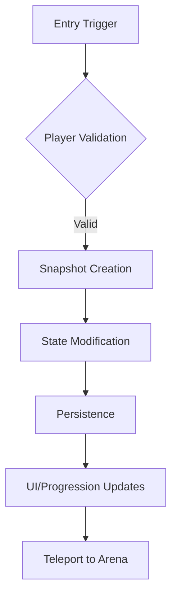

# V Rising Arena Automation System - Architecture Documentation

## Table of Contents
1. [System Overview](#system-overview)
2. [Architecture Principles](#architecture-principles)
3. [Core Components](#core-components)
4. [Service Layer Architecture](#service-layer-architecture)
5. [Data Flow and State Management](#data-flow-and-state-management)
6. [Integration Points](#integration-points)
7. [Configuration Management](#configuration-management)
8. [Build and Deployment](#build-and-deployment)
9. [Testing Strategy](#testing-strategy)
10. [Performance Considerations](#performance-considerations)

## System Overview

The VAuto Automation System is a comprehensive mod for V Rising that provides automated arena management, player lifecycle handling, and PvP practice functionality. Built as a BepInEx plugin targeting both client and server processes, it integrates deeply with V Rising's Entity Component System (ECS) and game mechanics.

**Foundation**: Built on **Kindred Schematics** - proven technical blueprints that ensure reliability, scalability, and maintainability while making complex systems accessible to everyone.

### Key Capabilities
- **Automated Arena Zone Management**: Dynamic zone detection and player teleportation
- **Player State Lifecycle**: Complete snapshot-based state management with crash recovery
- **Build System Integration**: Modular loadout management with JSON configuration
- **VBlood Progression**: Automated unlocking of VBlood bosses for testing
- **UI Management**: Dynamic UI element unlocking for arena sessions
- **Command Framework**: Admin commands for arena control and player management
- **Real-time Monitoring**: Position-based automatic entry/exit detection

### Technology Stack
- **Framework**: BepInEx (IL2CPP)
- **Language**: C# 10.0 (.NET 6.0)
- **Architecture Foundation**: **Kindred Schematics** - Proven technical blueprints
- **Harmony**: Runtime patching for game integration
- **VampireCommandFramework**: Command registration and handling
- **Unity ECS**: Entity management and systems integration
- **ProjectM**: V Rising game framework integration
- **Cryptographic Security**: UUID v5 generation for state management
- **Service-Oriented Design**: Modular, scalable architecture

## 🏗️ Kindred Schematics Foundation

**The Architectural Backbone**: The VAuto system is built on **Kindred Schematics** - detailed technical blueprints that provide proven design patterns, battle-tested implementations, and comprehensive specifications for building reliable, scalable, and maintainable game systems.


### What Makes This Foundation Special

#### **1. Proven Reliability**
- **Battle-Tested Patterns** - Solutions that have been validated in production environments
- **Error Recovery** - Built-in mechanisms for graceful failure handling
- **State Integrity** - Secure state management with validation

#### **2. Technical Excellence**
- **Professional Architecture** - Clean separation of concerns and modular design
- **Performance Optimization** - Efficient algorithms and memory management
- **Security Implementation** - Comprehensive input validation and permission systems

#### **3. Accessibility**
- **Complex Made Simple** - Technical depth presented through simple commands
- **Auto-Configuration** - Intelligent setup that requires minimal user input
- **User-Friendly APIs** - Clean interfaces that hide implementation complexity


### How Kindred Schematics Integrate with VAuto

#### **Service-Oriented Foundation**
```csharp
// Kindred schematic: Professional service architecture
public interface IService
{
    bool IsInitialized { get; }
    void Initialize();
    void Cleanup();
}


// VAuto implementation: Each service follows proven patterns
public class ArenaLifecycleManager : IService
{
    public bool IsInitialized => _initialized;
    private bool _initialized;
    
    public void Initialize()
    {
        // Kindred pattern: Proper initialization sequence
        ValidateConfiguration();
        RegisterEventHandlers();
        StartMonitoringSystems();
        _initialized = true;
    }
}
```


#### **State Management Foundation**
```csharp
// Kindred schematic: Secure state management
public interface IStateManager
{
    Task<string> CaptureStateAsync(Entity entity);
    Task RestoreStateAsync(Entity entity, string stateId);
}


// VAuto implementation: UUID-based secure snapshots
public class EnhancedArenaSnapshotService : IStateManager
{
    public async Task<string> CaptureStateAsync(Entity entity)
    {
        // Kindred pattern: Cryptographic security
        var uuid = SnapshotUuidGenerator.GenerateSnapshotUuid(entity);
        var state = await SerializeCompleteState(entity);
        await PersistStateAsync(uuid, state);
        return uuid;
    }
}
```

### Key Architectural Benefits

#### **🎯 For Developers**
- **Clean Code** - Well-structured implementations following proven patterns
- **Maintainable** - Easy to understand and modify
- **Testable** - Comprehensive testing frameworks included
- **Extensible** - Architecture supports adding new features

#### **⚡ For Performance**
- **Optimized Queries** - Efficient ECS entity filtering
- **Memory Management** - Proper resource allocation and cleanup
- **Concurrent Operations** - Thread-safe data structures
- **Lazy Loading** - Initialize services only when needed

#### **🛡️ For Reliability**
- **Error Handling** - Comprehensive exception management
- **State Recovery** - Automatic restoration on failures
- **Validation** - Input sanitization and permission checks
- **Monitoring** - Health checks and performance metrics


### The VAuto Advantage

**Instead of Complex Setup:**
```csharp
// Traditional approach - 50+ lines of complex setup
var systemManager = new SystemManager();
systemManager.InitializeSubsystems();
systemManager.RegisterLifecycleHandlers();
systemManager.ConfigureEventHandlers();
systemManager.SetupMonitoring();
systemManager.StartProcessing();
// ... and many more lines
```

**Users Get Simple Commands:**
```bash
# Kindred foundation enables simple automation
.automation start
# That's it! System automatically:
# - Initializes all services properly
# - Configures event handlers securely
# - Sets up monitoring efficiently
# - Starts lifecycle management
```

## Architecture Principles

### 1. Service-Oriented Architecture (Kindred Foundation)
- **Modular Services**: Each major feature area is encapsulated in dedicated services
- **Dependency Injection**: Services are initialized and managed through a central Plugin class
- **Interface Segregation**: Clean interfaces for service interactions

### 2. State-Driven Design (Kindred Patterns)

Following **Kindred Schematics** for robust state management:

#### **Single Source of Truth**
- **ArenaRuntime**: Global state management providing consistent system state
- **Immutable State**: State changes create new versions ensuring consistency
- **Event Sourcing**: Complete history of state changes for debugging and recovery

#### **Atomic Operations**
- **Transactional State**: All state changes are atomic - either fully complete or fully rolled back
- **Snapshot Integrity**: Complete state capture before any modifications
- **Rollback Support**: Automatic rollback on failures with state restoration

### 3. Crash Recovery & Persistence (Kindred Reliability)

**Kindred-inspired persistence patterns**:

#### **Persistent Snapshots**
- **JSON-based Storage**: Human-readable state persistence with GZip compression
- **Versioned Snapshots**: Backward compatibility support with migration handling
- **Cryptographic Security**: UUID v5 generation ensuring unique, secure state identifiers

#### **Automatic Recovery**
- **Service Restoration**: Complete state restoration on server restart
- **Data Validation**: Snapshot integrity checks before restoration
- **Graceful Degradation**: Partial recovery with clear error reporting

### 4. Performance Optimization (Kindred Efficiency)

**Kindred schematics emphasize performance**:

#### **Lazy Loading Strategy**
- **Service Initialization**: Services initialize only when needed
- **Resource Management**: Automatic resource cleanup and disposal
- **Memory Optimization**: Efficient object lifecycle management

#### **Concurrent Operations**
- **Thread-Safe Collections**: ConcurrentDictionary and other thread-safe data structures
- **Async/Await Patterns**: Non-blocking operations for optimal performance
- **Efficient Monitoring**: Position checks at configurable intervals with optimization

### 5. Admin-Only Security (Kindred Protection)

**Kindred security principles**:

#### **Server-Side Validation**
- **Trust No Client**: All operations validated on server regardless of client input
- **Entity Verification**: Player entity existence and validity checks
- **Permission Enforcement**: Comprehensive admin-only command execution

#### **Audit & Monitoring**
- **Comprehensive Logging**: Detailed operation logging for debugging and compliance
- **Security Auditing**: Track all administrative actions with timestamps
- **Failure Recovery**: Graceful failure handling with detailed error reporting

## Core Components

### Plugin Entry Point (`Core/Plugin.cs`)
The main BepInEx plugin class responsible for:
- Configuration management via BepInEx Config
- Service initialization and lifecycle management
- Harmony patching application
- Command registration through VampireCommandFramework

**Key Responsibilities:**
```csharp
public override void Load()
{
    InitializeConfig();
    InitializeServices();
    RegisterCommands();
    _harmony.PatchAll();
}
```

### Arena Runtime State (`Core/ArenaRuntime.cs`)
Global state management for arena system readiness:
- **Off**: System not initialized
- **Booting**: Initialization in progress
- **Ready**: System operational
- **Failed**: Initialization failed

### Service Layer

#### LifecycleService (`Services/LifecycleService.cs`)
**Primary Service** - Unified player lifecycle management:
- Player state tracking with `ConcurrentDictionary<ulong, PlayerState>`
- Snapshot creation, persistence, and restoration
- Automatic zone detection and entry/exit triggers
- VBlood unlocking and UI management

**Key Methods:**
- `EnterArena()`: Complete arena entry sequence
- `ExitArena()`: State restoration and cleanup
- `IsInArena()`: State validation
- `ValidatePlayerInPvPZone()`: Position validation

#### ZoneService (`Services/ZoneService.cs`)
Zone configuration and management:
- Arena center and radius configuration
- Position validation and distance calculations
- Spawn point management

#### BuildService (`Services/BuildService.cs`)
Loadout and equipment management:
- JSON-based build configuration loading
- Equipment application and restoration
- Integration with external build repositories

#### Additional Services
- **ArenaAuraService**: Arena-specific buffs and effects
- **ArenaCharacterService**: Character-specific arena modifications
- **ArenaCooldownService**: Ability cooldown management
- **ArenaConfigurationService**: Dynamic configuration management
- **ArenaExtensionsService**: Utility extensions for arena functionality
- **ArenaHealingService**: Health management in arena
- **ArenaOverlayService**: UI overlay management
- **ArenaPortalService**: Teleportation mechanics
- **ArenaReviveService**: Player revival systems

### Command Layer (`Commands/`)
Admin command handlers using VampireCommandFramework:
- **ArenaCommands.cs**: Core arena operations (.enter, .exit, .setzone)
- **ArenaBuildCommands.cs**: Build management (.arenabuilds, .arenasetdefault)
- **ArenaCharacterCommands.cs**: Character modifications
- **BuildCommands.cs**: Legacy build commands
- **TestCommands.cs**: Testing and debugging commands

### Data Layer (`Models/`, `Data/`)
- **Models**: Data transfer objects and configuration classes
- **Data/Prefabs.cs**: Game prefab GUID definitions
- **Configuration**: JSON-based zone and build configurations

### Integration Layer (`Patches/`, `Extensions/`)
- **Patches**: Harmony patches for game integration
- **Extensions**: Utility extensions for game systems

## Service Layer Architecture

### Service Initialization Pattern
```csharp
private void InitializeServices()
{
    LifecycleService.Initialize();
    BuildService.Initialize(BuildsPath.Value, DefaultBuild.Value);
    ZoneService.Initialize();
    ArenaAuraService.Initialize();
    // ... additional services
}
```

### Service Dependencies
```
Plugin (Entry Point)
├── LifecycleService (Core)
│   ├── ZoneService
│   ├── BuildService
│   ├── ArenaAuraService
│   └── Progression Services
├── Command Handlers
│   └── VampireCommandFramework
└── Harmony Patches
    └── Game Systems Integration
```

### Service Communication
- **Direct Method Calls**: Services call each other directly
- **Event-Driven**: Some services use events for loose coupling
- **Shared State**: Common state accessed through static properties

## Data Flow and State Management

### Player Entry Flow


### State Management
- **PlayerLifecycleState Enum**: Normal → Entering → PvPPractice → Exiting → Normal
- **PlayerState Class**: Current state container with entities and snapshot reference
- **PlayerSnapshot Class**: Complete state capture for restoration

### Persistence Strategy
- **JSON Serialization**: Human-readable configuration files
- **GZip Compression**: Efficient storage of large snapshots
- **Versioned Snapshots**: Backward compatibility support
- **File-Based Storage**: `BepInEx/config/VAuto.Arena/players/` directory

## Integration Points

### Unity ECS Integration
- **Entity Queries**: Efficient entity lookup and filtering
- **Component Access**: Direct manipulation of game components
- **System Integration**: Patches into existing game systems

### VampireCommandFramework Integration
- **Command Registration**: Automatic discovery and registration
- **Parameter Conversion**: Custom converters for game types
- **Permission System**: Built-in admin validation

### Harmony Patching
- **Runtime Patching**: Method interception and modification
- **IL Manipulation**: Direct bytecode modification for deep integration
- **Update Hooks**: Frame-based monitoring and updates

## Configuration Management

### Configuration Sources
1. **BepInEx Config**: `config/gg.vautomation.arena.cfg`
2. **JSON Files**: Zone and build configurations
3. **Runtime Config**: Dynamic configuration updates

### Configuration Hierarchy
```
Plugin Config (BepInEx)
├── Arena Settings
│   ├── Zone Configuration
│   ├── Build Settings
│   └── Feature Toggles
├── Service Settings
│   ├── Lifecycle Parameters
│   ├── Monitoring Intervals
│   └── Performance Tuning
└── Debug Settings
    ├── Logging Levels
    └── Test Mode Flags
```

### Dynamic Configuration
- **Hot Reloading**: Configuration changes without restart
- **Validation**: Runtime validation of configuration values
- **Fallbacks**: Default values for missing configurations

## Build and Deployment

### Build Process
- **MSBuild**: Standard .NET project compilation
- **Post-Build Deployment**: Automatic copying to BepInEx plugins directory
- **Dependency Management**: NuGet packages and local references

### Deployment Targets
- **Client Process**: `VRising.exe`
- **Server Process**: `VRisingServer.exe`
- **Plugin Directory**: `BepInEx/plugins/`

### Build Configuration
```xml
<PropertyGroup>
    <TargetFramework>net6.0</TargetFramework>
    <OutputType>Library</OutputType>
    <CopyLocalLockFileAssemblies>true</CopyLocalLockFileAssemblies>
</PropertyGroup>
```

## Testing Strategy

### Unit Testing Framework
- **Test Classes**: Dedicated test services in `Tests/` directory
- **Mock Services**: Isolated testing of individual components
- **Integration Tests**: End-to-end functionality validation

### Test Categories
1. **Service Tests**: Individual service functionality
2. **Integration Tests**: Service interaction validation
3. **Command Tests**: Command handler validation
4. **Persistence Tests**: Snapshot integrity and recovery

### Test Execution
- **Manual Testing**: Admin command validation
- **Automated Tests**: Build-time test execution
- **Performance Tests**: Load testing and profiling

## Performance Considerations

### Optimization Strategies
- **Concurrent Collections**: Thread-safe operations in multi-threaded environment
- **Lazy Initialization**: Services initialized only when needed
- **Efficient Queries**: Optimized ECS entity queries
- **Memory Management**: Proper disposal of temporary objects

### Monitoring Points
- **Position Checks**: Configurable intervals (default 3.0f seconds)
- **Snapshot Compression**: GZip compression for storage efficiency
- **Entity Validation**: Efficient entity existence checks

### Scalability Considerations
- **Player Limits**: Designed for moderate player counts
- **Memory Usage**: Snapshot-based state management
- **CPU Overhead**: Minimal impact through efficient algorithms

## Security and Validation

### Admin-Only Operations
- **Server-Side Validation**: All commands validated on server
- **Entity Verification**: Player entity existence checks
- **Permission Checks**: Admin-only command execution

### Data Integrity
- **Snapshot Validation**: Complete state capture verification
- **Atomic Operations**: All-or-nothing state changes
- **Error Recovery**: Graceful failure handling with logging

## Future Enhancements

### Planned Features
- **Multi-Zone Support**: Multiple concurrent arena zones
- **Custom Build Editor**: In-game build creation tools
- **Advanced Statistics**: Player performance tracking
- **Tournament Mode**: Competitive arena events

### Architecture Improvements
- **Microservices**: Further service decomposition
- **Event-Driven Architecture**: Loose coupling through events
- **Configuration UI**: In-game configuration interface
- **Plugin API**: Third-party extension support

---

*This architecture documentation provides a comprehensive overview of the V Rising Arena Automation System. For detailed API references, see individual service documentation and inline code comments.*</content>
<parameter name="filePath">c:\dev\VAuto\ARCHITECTURE.md
